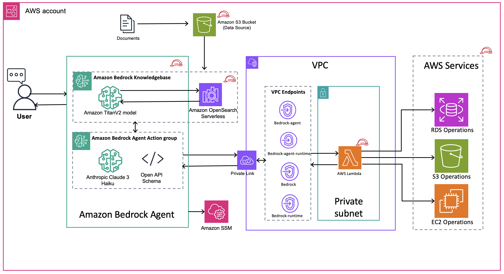

// Copyright Amazon.com, Inc. or its affiliates. All Rights Reserved.

// SPDX-License-Identifier: MIT-0

## Introduction

This solution introduces an intelligent Infrastructure Orchestrator Assistant powered by Amazon Bedrock Agents, serving as a comprehensive framework for managing and optimizing AWS services through natural language interactions. The assistant leverages Amazon Bedrock Knowledge Bases to provide accurate, context-aware guidance for managing core AWS services (EC2, S3, RDS) while strictly adhering to Well-Architected Framework principles. At its core, the solution automates the provisioning and management of essential components including Amazon Bedrock Agents, Knowledge Bases, AWS Lambda functions for service actions, Amazon OpenSearch Serverless (AOSS) for enhanced search capabilities, and precisely configured IAM roles that secure service interactions. The framework implements an automated custom logic lifecycle that streamlines agent preparation, creates and manages agent aliases, and seamlessly handles updates to Action Group AWS Lambda code and Knowledge Base content. This ensures the assistant remains current and effective in high-velocity infrastructure management environments. Through its interactive workflow, the assistant collects necessary details, executes infrastructure changes via Lambda functions, and maintains a strict user confirmation process, making infrastructure management more accessible while preventing unintended changes. This approach not only simplifies AWS service management but also ensures consistency, reduces human error, and maintains security best practices in infrastructure operations.
 

## Architecture



## Pre-requisites
1. Install and use latest [Terraform CLI](https://developer.hashicorp.com/terraform/tutorials/aws-get-started/install-cli)
2. An AWS account.
3. This solution expects the operations team to carefully delegate the access for the corresponding services created by the solution.
4. AWS CLI V2 version
5. Please use the latest provider versions
6. Make sure add authentication in the open API Schema
7. The models used in this solution are Amazon Titan Text V2 and Claude3 Haiku. Please make sure that these are enabled in the account before deploying the code.
8. Cross check the region and the model access before deploying this.
9. A regulated VPC as per the best practices from the AWS Well Architected Framework.
10. A KMS key with security best practices


## Software Requirements

| Name | Version |
|------|---------|
| <a name="requirement_aws"></a> [aws](#requirement\_aws) | ~> 5.69 |
| <a name="requirement_external"></a> [external](#requirement\_external) | 2.3.3 |
| <a name="requirement_random"></a> [random](#requirement\_random) | 3.6.2 |

## Deployment instructions

1. Clone this repository using below command 
```
git clone "git@github.com:aws-samples/infra-ops-orchestrator.git"
```
2. Navigate into the project base directory
```
cd infra-ops-orchestrator
```
3. Initialize terraform 
```
terraform init
```
4. Run terraform plan to view the list of all the resources that this solution with create.  
```
terraform plan
```
**Note:** Make sure to check the `*tfvars` file and update relevant values before creating a plan. The code needs an existing VPC, KMS Key and an S3 bucket which is used as a source to deploy the Bedrock Action Group Lambda Function.

5. Run terraform apply. The flag --auto-approve is optional. If you don't use that, you will be prompted to enter a confirmation manually (Y/N)
```
terraform apply --auto-approve
```
6. After apply is successful, the "knowledge_base_bucket" will be given as one of the outputs. Upload the sample-datasource.txt into this bucket.
7. Go to Amazon Bedrock console-> Knowledgebases->Click on the newly created KB-> Datasource-> Click on sync. For more details check [this](https://docs.aws.amazon.com/bedrock/latest/userguide/kb-data-source-sync-ingest.html) documentation. 

Also make sure the `user input` is enabled in Agent!


## Infrastructure cleanup
For the cleanup of the insfrastructure please follow below steps:
1. Empty the datsource S3 Bucket
2. Navigate into the project base directory
``` 
cd intelligent-rag-bedrockagent-iac
```
3. The flag --auto-approve is optional. If you don't use that, you will be prompted to enter a confirmation manually (Y/N) 
terraform --destroy --auto-approve

## Modules

| Name | Source | Version |
|------|--------|---------|
| <a name="module_agent_update_lifecycle"></a> [agent\_update\_lifecycle](#module\_agent\_update\_lifecycle) | ./modules/bedrock/agent-lifecycle | n/a |
| <a name="module_aoss"></a> [aoss](#module\_aoss) | ./modules/aoss | n/a |
| <a name="module_bedrock_agent"></a> [bedrock\_agent](#module\_bedrock\_agent) | ./modules/bedrock/agent | n/a |
| <a name="module_bedrock_guardrail"></a> [bedrock\_guardrail](#module\_bedrock\_guardrail) | ./modules/bedrock/agent-guardrails | n/a |
| <a name="module_bedrock_knowledge_base"></a> [bedrock\_knowledge\_base](#module\_bedrock\_knowledge\_base) | ./modules/bedrock/knowledge_base | n/a |
| <a name="module_knowledge_base_bucket"></a> [knowledge\_base\_bucket](#module\_knowledge\_base\_bucket) | ./modules/s3 | n/a |
| <a name="module_roles"></a> [roles](#module\_roles) | ./modules/roles | n/a |
| <a name="module_vpc_endpoints"></a> [vpc\_endpoints](#module\_vpc\_endpoints) | ./modules/endpoints | n/a |

## Resources

No resources.

## Inputs

| Name | Description | Type | Default | Required |
|------|-------------|------|---------|:--------:|
| <a name="input_agent_action_group_name"></a> [agent\_action\_group\_name](#input\_agent\_action\_group\_name) | The Bedrock Agent Action Group Name | `string` | `""` | no |
| <a name="input_agent_actiongroup_descrption"></a> [agent\_actiongroup\_descrption](#input\_agent\_actiongroup\_descrption) | Description of the action group of the bedrock agent | `string` | `""` | no |
| <a name="input_agent_alias_name"></a> [agent\_alias\_name](#input\_agent\_alias\_name) | The Bedrock Agent Alias Name | `string` | `""` | no |
| <a name="input_agent_description"></a> [agent\_description](#input\_agent\_description) | Description of the agent | `string` | `""` | no |
| <a name="input_agent_instructions"></a> [agent\_instructions](#input\_agent\_instructions) | The type of agent | `string` | `""` | no |
| <a name="input_agent_model_id"></a> [agent\_model\_id](#input\_agent\_model\_id) | The ID of the foundational model used by the agent. | `string` | `""` | no |
| <a name="input_agent_name"></a> [agent\_name](#input\_agent\_name) | The Bedrock Agent Name | `string` | `""` | no |
| <a name="input_aoss_collection_name"></a> [aoss\_collection\_name](#input\_aoss\_collection\_name) | OpenSearch Collection Name | `string` | `""` | no |
| <a name="input_aoss_collection_type"></a> [aoss\_collection\_type](#input\_aoss\_collection\_type) | OpenSearch Collection Type | `string` | `""` | no |
| <a name="input_app_name"></a> [app\_name](#input\_app\_name) | n/a | `string` | `"acme"` | no |
| <a name="input_app_region"></a> [app\_region](#input\_app\_region) | n/a | `string` | `""` | no |
| <a name="input_bedrock_agent_invoke_log_bucket"></a> [bedrock\_agent\_invoke\_log\_bucket](#input\_bedrock\_agent\_invoke\_log\_bucket) | The Bedrock Agent Name | `string` | `""` | no |
| <a name="input_cidr_blocks_sg"></a> [cidr\_blocks\_sg](#input\_cidr\_blocks\_sg) | VPC/Subnets CIDR blocks to specify in Security Group | `list(string)` | `[]` | no |
| <a name="input_code_base_bucket"></a> [code\_base\_bucket](#input\_code\_base\_bucket) | Lambda Code Zip Name in S3 Bucket | `string` | `""` | no |
| <a name="input_code_base_zip"></a> [code\_base\_zip](#input\_code\_base\_zip) | Lambda Code Zip Name in S3 Bucket | `string` | `""` | no |
| <a name="input_enable_access_logging"></a> [enable\_access\_logging](#input\_enable\_access\_logging) | Option to enable Access logging of Knowledge base bucket | `bool` | `true` | no |
| <a name="input_enable_endpoints"></a> [enable\_endpoints](#input\_enable\_endpoints) | Whether to enable VPC Endpoints | `bool` | `true` | no |
| <a name="input_enable_guardrails"></a> [enable\_guardrails](#input\_enable\_guardrails) | Whether to enable Bedrock guardrails | `bool` | `true` | no |
| <a name="input_enable_s3_lifecycle_policies"></a> [enable\_s3\_lifecycle\_policies](#input\_enable\_s3\_lifecycle\_policies) | Option to enable Lifecycle policies for Knowledge base bucket Objects | `bool` | `true` | no |
| <a name="input_env_name"></a> [env\_name](#input\_env\_name) | n/a | `string` | `""` | no |
| <a name="input_guardrail_blocked_input_messaging"></a> [guardrail\_blocked\_input\_messaging](#input\_guardrail\_blocked\_input\_messaging) | Blocked input messaging for the Bedrock Guardrail | `string` | `""` | no |
| <a name="input_guardrail_blocked_outputs_messaging"></a> [guardrail\_blocked\_outputs\_messaging](#input\_guardrail\_blocked\_outputs\_messaging) | Blocked outputs messaging for the Bedrock Guardrail | `string` | `""` | no |
| <a name="input_guardrail_content_policy_config"></a> [guardrail\_content\_policy\_config](#input\_guardrail\_content\_policy\_config) | Content policy configuration for the Bedrock Guardrail | `any` | `[]` | no |
| <a name="input_guardrail_description"></a> [guardrail\_description](#input\_guardrail\_description) | Description of the Bedrock Guardrail | `string` | `""` | no |
| <a name="input_guardrail_name"></a> [guardrail\_name](#input\_guardrail\_name) | Name of the Bedrock Guardrail | `string` | `""` | no |
| <a name="input_guardrail_sensitive_information_policy_config"></a> [guardrail\_sensitive\_information\_policy\_config](#input\_guardrail\_sensitive\_information\_policy\_config) | Sensitive information policy configuration for the Bedrock Guardrail | `any` | `[]` | no |
| <a name="input_guardrail_topic_policy_config"></a> [guardrail\_topic\_policy\_config](#input\_guardrail\_topic\_policy\_config) | Topic policy configuration for the Bedrock Guardrail | `any` | `[]` | no |
| <a name="input_guardrail_word_policy_config"></a> [guardrail\_word\_policy\_config](#input\_guardrail\_word\_policy\_config) | Word policy configuration for the Bedrock Guardrail | `any` | `[]` | no |
| <a name="input_kb_instructions_for_agent"></a> [kb\_instructions\_for\_agent](#input\_kb\_instructions\_for\_agent) | Description of the agent | `string` | `""` | no |
| <a name="input_kms_key_id"></a> [kms\_key\_id](#input\_kms\_key\_id) | Optional ID of the KMS key | `string` | `""` | no |
| <a name="input_knowledge_base_model_id"></a> [knowledge\_base\_model\_id](#input\_knowledge\_base\_model\_id) | The ID of the foundational model used by the knowledge base. | `string` | `""` | no |
| <a name="input_knowledge_base_name"></a> [knowledge\_base\_name](#input\_knowledge\_base\_name) | Name of the Bedrock Knowledge Base | `string` | `""` | no |
| <a name="input_vpc_id"></a> [vpc\_id](#input\_vpc\_id) | VPC ID | `string` | `""` | no |
| <a name="input_vpc_subnet_ids"></a> [vpc\_subnet\_ids](#input\_vpc\_subnet\_ids) | List of Subnet Ids | `list(string)` | `[]` | no |

## Outputs

| Name | Description |
|------|-------------|
| <a name="output_agent_actiongroup_lambda_arn"></a> [agent\_actiongroup\_lambda\_arn](#output\_agent\_actiongroup\_lambda\_arn) | Bedrock Agent Action Group Lambda ARN |
| <a name="output_agent_actiongroup_lambda_name"></a> [agent\_actiongroup\_lambda\_name](#output\_agent\_actiongroup\_lambda\_name) | Bedrock Agent Action Group Lambda Name |
| <a name="output_agent_arn"></a> [agent\_arn](#output\_agent\_arn) | Bedrock Agent ARN |
| <a name="output_agent_id"></a> [agent\_id](#output\_agent\_id) | Bedrock Agent ID |
| <a name="output_agent_name"></a> [agent\_name](#output\_agent\_name) | Bedrock Agent Name |
| <a name="output_aoss_collection_arn"></a> [aoss\_collection\_arn](#output\_aoss\_collection\_arn) | AOSS Collection ARN |
| <a name="output_aoss_collection_id"></a> [aoss\_collection\_id](#output\_aoss\_collection\_id) | AOSS Collection ID |
| <a name="output_aoss_collection_name"></a> [aoss\_collection\_name](#output\_aoss\_collection\_name) | AOSS Collection Name |
| <a name="output_bedrock_agent_action_group_instruction"></a> [bedrock\_agent\_action\_group\_instruction](#output\_bedrock\_agent\_action\_group\_instruction) | Bedrock Agent Action Group Instruction |
| <a name="output_bedrock_agent_instruction"></a> [bedrock\_agent\_instruction](#output\_bedrock\_agent\_instruction) | Bedrock Agent Instruction |
| <a name="output_bedrock_guardrail_arn"></a> [bedrock\_guardrail\_arn](#output\_bedrock\_guardrail\_arn) | The ARN of the created Bedrock Guardrail |
| <a name="output_bedrock_guardrail_id"></a> [bedrock\_guardrail\_id](#output\_bedrock\_guardrail\_id) | The ID of the created Bedrock Guardrail |
| <a name="output_bedrock_vpc_endpoint_ids"></a> [bedrock\_vpc\_endpoint\_ids](#output\_bedrock\_vpc\_endpoint\_ids) | n/a |
| <a name="output_knowledge_base_arn"></a> [knowledge\_base\_arn](#output\_knowledge\_base\_arn) | Knowledge Base Name |
| <a name="output_knowledge_base_bucket"></a> [knowledge\_base\_bucket](#output\_knowledge\_base\_bucket) | Knowledge Base Bucket |
| <a name="output_knowledge_base_data_source_id"></a> [knowledge\_base\_data\_source\_id](#output\_knowledge\_base\_data\_source\_id) | Knowledge Base Data Source ID |
| <a name="output_knowledge_base_id"></a> [knowledge\_base\_id](#output\_knowledge\_base\_id) | Knowledge Base ID |
| <a name="output_knowledge_base_name"></a> [knowledge\_base\_name](#output\_knowledge\_base\_name) | Knowledge Base Name |
| <a name="output_lambda_code_sha"></a> [lambda\_code\_sha](#output\_lambda\_code\_sha) | SSM Paramater for Action Group Lambda SHA |
| <a name="output_s3_endpoint_id"></a> [s3\_endpoint\_id](#output\_s3\_endpoint\_id) | n/a |
| <a name="output_ssm_parameter_agent_ag_instruction"></a> [ssm\_parameter\_agent\_ag\_instruction](#output\_ssm\_parameter\_agent\_ag\_instruction) | SSM Paramater for Bedrock Agent Action Group Instruction |
| <a name="output_ssm_parameter_agent_alias"></a> [ssm\_parameter\_agent\_alias](#output\_ssm\_parameter\_agent\_alias) | SSM Paramater for Bedrock Agent Alias |
| <a name="output_ssm_parameter_agent_arn"></a> [ssm\_parameter\_agent\_arn](#output\_ssm\_parameter\_agent\_arn) | SSM Paramater for Bedrock Agent ARN |
| <a name="output_ssm_parameter_agent_id"></a> [ssm\_parameter\_agent\_id](#output\_ssm\_parameter\_agent\_id) | SSM Paramater for Bedrock Agent ID |
| <a name="output_ssm_parameter_agent_instruction"></a> [ssm\_parameter\_agent\_instruction](#output\_ssm\_parameter\_agent\_instruction) | SSM Paramater for Bedrock Agent Instruction |
| <a name="output_ssm_parameter_agent_instruction_history"></a> [ssm\_parameter\_agent\_instruction\_history](#output\_ssm\_parameter\_agent\_instruction\_history) | SSM Paramater for Agent Instruction History |
| <a name="output_ssm_parameter_agent_name"></a> [ssm\_parameter\_agent\_name](#output\_ssm\_parameter\_agent\_name) | SSM Paramater for Bedrock Agent Name |
| <a name="output_ssm_parameter_kb_instruction_history"></a> [ssm\_parameter\_kb\_instruction\_history](#output\_ssm\_parameter\_kb\_instruction\_history) | SSM Paramater for  Knowledge Base Instruction History |
| <a name="output_ssm_parameter_knowledge_base_data_source_id"></a> [ssm\_parameter\_knowledge\_base\_data\_source\_id](#output\_ssm\_parameter\_knowledge\_base\_data\_source\_id) | SSM Paramater for Knowledge Base Data Source ID |
| <a name="output_ssm_parameter_knowledge_base_id"></a> [ssm\_parameter\_knowledge\_base\_id](#output\_ssm\_parameter\_knowledge\_base\_id) | SSM Paramater for Knowledge Base ID |
| <a name="output_ssm_parameter_lambda_code_sha"></a> [ssm\_parameter\_lambda\_code\_sha](#output\_ssm\_parameter\_lambda\_code\_sha) | SSM Paramater for Action Group Lambda SHA |
| <a name="output_vpc_endpoint_ids"></a> [vpc\_endpoint\_ids](#output\_vpc\_endpoint\_ids) | n/a |


## Solution Testing Demo Video

### Please follow the below video for utility testing

